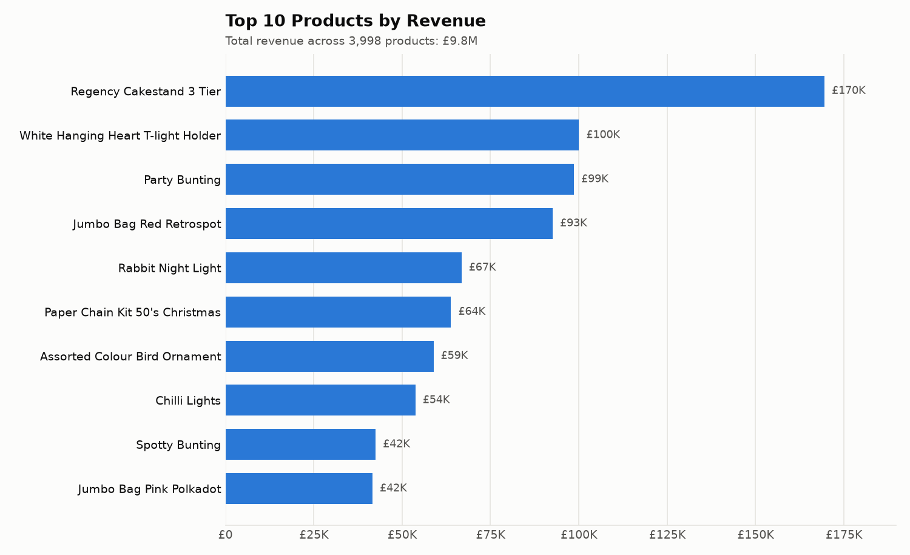
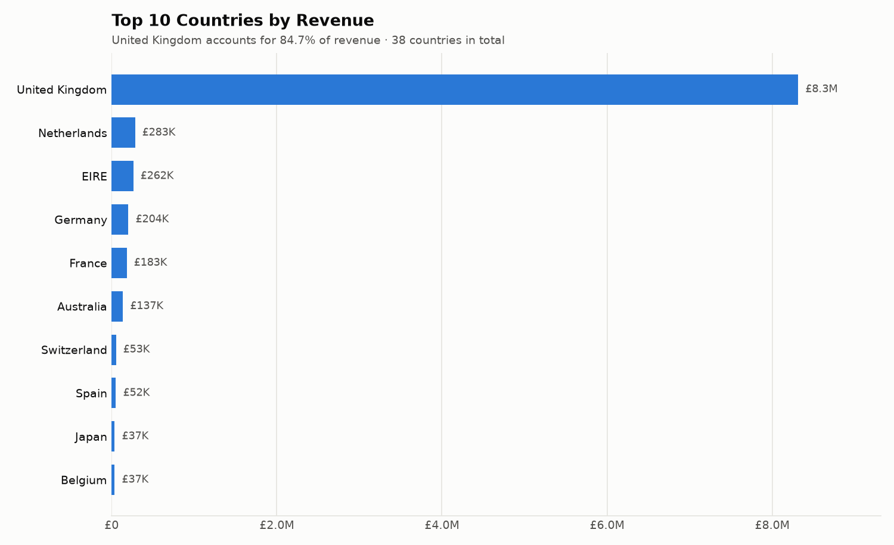
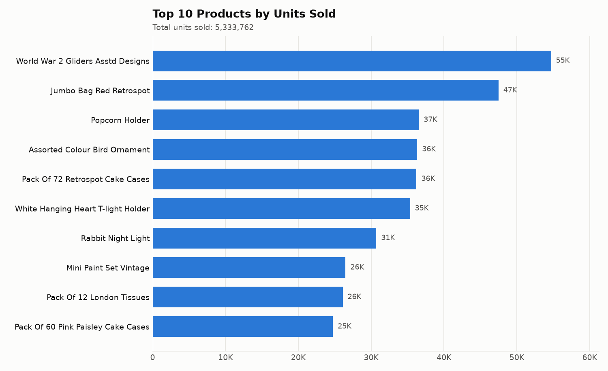
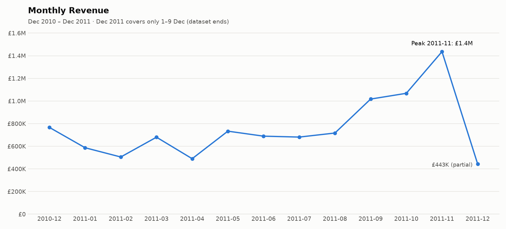
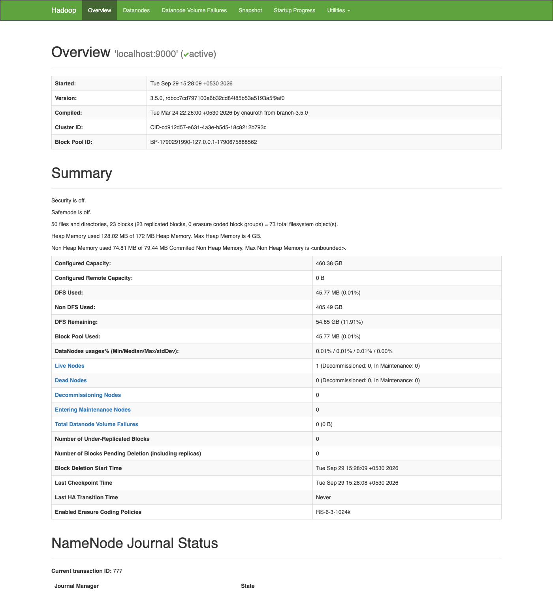
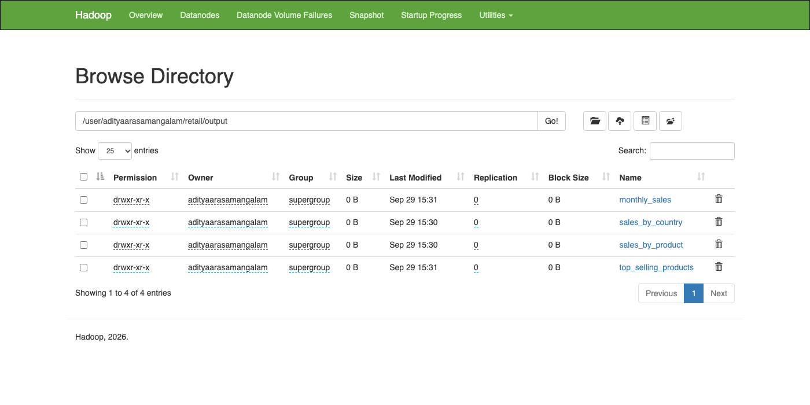
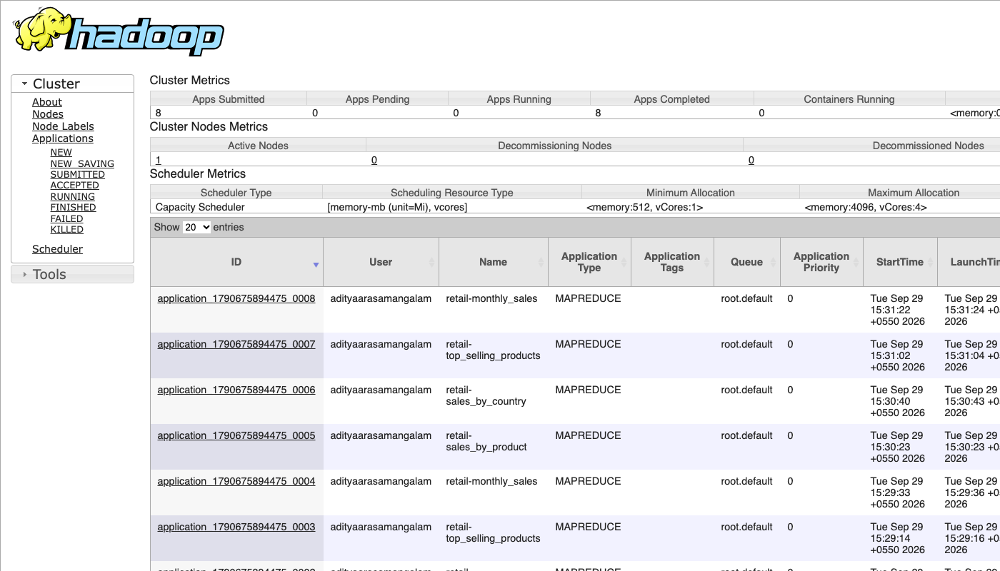
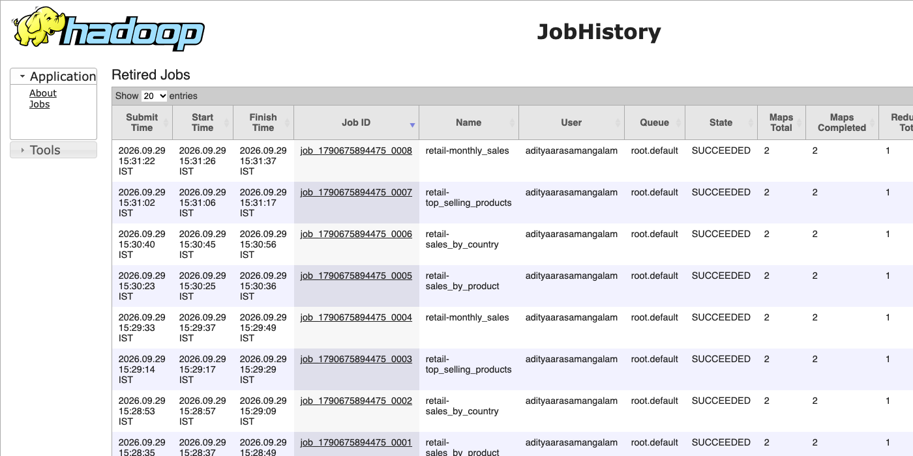

# E-Commerce Sales Data Analysis Using Hadoop MapReduce

Analysis of the [UCI Online Retail dataset](https://archive.ics.uci.edu/dataset/352/online+retail)
(541,909 transactions from a UK-based online retailer, Dec 2010 – Dec 2011) using
**Hadoop MapReduce** with **Python** mappers/reducers via **Hadoop Streaming**, and
**Matplotlib** for the graphs.

## Workflow

```
Online Retail Dataset (.xlsx)
        │
        ▼
  Data Cleaning  (scripts/clean_data.py → tab-separated file)
        │
        ▼
      HDFS  (hdfs dfs -put)
        │
        ▼
 Hadoop MapReduce (Hadoop Streaming, 4 jobs)
   Mapper ──► Combiner ──► Shuffle & Sort ──► Reducer
        │
        ▼
 Results (part-00000 per job)  ──►  Verification (pandas cross-check)
        │
        ▼
 Graphs + ranked summary tables (scripts/visualize.py)
```

## MapReduce jobs

| # | Job | Mapper emits | Reducer outputs |
|---|-----|--------------|-----------------|
| 1 | **Sales by Product** – which products generate the highest revenue | `Description → Quantity × UnitPrice` | total revenue per product |
| 2 | **Sales by Country** – which countries generate the most revenue | `Country → Quantity × UnitPrice` | total revenue per country |
| 3 | **Top-Selling Products** – products with the highest quantity sold | `Description → Quantity` | total units per product |
| 4 | **Monthly Sales Analysis** – how revenue changes month by month | `YYYY-MM → Quantity × UnitPrice` | total revenue per month |

Each reducer is a sum over a key-sorted stream, which is associative and
commutative, so the same script is also used as the **combiner** to cut down the
data sent across the network during the shuffle.

Example for job 2 (Sales by Country):

```
Input line   : 536370  22728  ALARM CLOCK BAKELIKE PINK  24  2010-12-01 08:45  3.75  12583  France
Mapper       : France          90.00
Shuffle/Sort : France          [90.00, 29.50, ...]      (all values for a key arrive together)
Reducer      : France          182697.39
```

## Data cleaning

`scripts/clean_data.py` converts the Excel file into a tab-separated file
(tabs are safe because some product descriptions contain commas):

| Step | Rows left |
|------|----------:|
| Raw dataset | 541,909 |
| Drop missing descriptions | 540,455 |
| Drop cancelled invoices (`InvoiceNo` starts with `C`) **and the order lines they reverse** | 527,979 |
| Drop `Quantity <= 0` or `UnitPrice <= 0` | 526,919 |
| Drop non-product stock codes (postage, bank charges, fees, manual adjustments) | 524,688 |
| Drop exact duplicates | **519,516** |

Removing the reversed order lines matters: the dataset has a few huge orders that
were cancelled minutes later (e.g. 80,995 × "PAPER CRAFT, LITTLE BIRDIE"). If you
drop only the cancellation rows, those orders still show up as the top-selling
products even though they never sold.

## Results

Total revenue after cleaning: **£9,815,291.49** across 3,998 products and 38 countries.

### 1. Sales by Product


| Rank | Product | Revenue |
|-----:|---------|--------:|
| 1 | Regency Cakestand 3 Tier | £169,505.64 |
| 2 | White Hanging Heart T-Light Holder | £100,052.42 |
| 3 | Party Bunting | £98,610.18 |
| 4 | Jumbo Bag Red Retrospot | £92,595.77 |
| 5 | Rabbit Night Light | £66,807.63 |

### 2. Sales by Country


The United Kingdom accounts for **84.7%** of revenue. The next biggest markets are the
Netherlands (2.9%), EIRE (2.7%), Germany (2.1%) and France (1.9%).

### 3. Top-Selling Products (by quantity)


| Rank | Product | Units sold |
|-----:|---------|-----------:|
| 1 | World War 2 Gliders Asstd Designs | 54,711 |
| 2 | Jumbo Bag Red Retrospot | 47,488 |
| 3 | Popcorn Holder | 36,546 |
| 4 | Assorted Colour Bird Ornament | 36,333 |
| 5 | Pack of 72 Retrospot Cake Cases | 36,228 |

Low-priced items lead on volume, while the top earner (Regency Cakestand, ~£12
each) ranks outside the top 10 by units. Only Jumbo Bag Red Retrospot, White
Hanging Heart T-Light Holder, Rabbit Night Light and Assorted Colour Bird Ornament
appear in both top-10 lists.

### 4. Monthly Sales


Revenue is fairly flat at roughly £0.5M–£0.77M a month from December 2010 to August 2011, then
climbs through autumn to a peak of **£1.44M in November 2011** (pre-Christmas
wholesale buying). December 2011 looks low only because the dataset ends on
9 December.

Full tables are in [results/summary/](results/summary/) and the raw MapReduce
output is in [results/output/](results/output/).

## Project structure

```
├── backend/
│   ├── main.py                 FastAPI REST API serving the results
│   ├── requirements.txt
│   └── tests/test_api.py       API tests
├── hadoop/conf/                single-node Hadoop config (core, hdfs, mapred, yarn)
├── mapreduce/
│   ├── sales_by_product/       mapper.py, reducer.py
│   ├── sales_by_country/       mapper.py, reducer.py
│   ├── top_selling_products/   mapper.py, reducer.py
│   └── monthly_sales/          mapper.py, reducer.py
├── scripts/
│   ├── download_data.sh        downloads the dataset into data/raw/
│   ├── hadoop_start.sh         starts HDFS + YARN (hadoop_stop.sh stops them)
│   ├── hadoop_env.sh           Hadoop environment variables for your shell
│   ├── clean_data.py           cleaning step → data/cleaned/online_retail_clean.tsv
│   ├── verify_results.py       checks MapReduce output against pandas
│   └── visualize.py            graphs + ranked CSV tables
├── tests/test_mapreduce.py     unit tests for every mapper/reducer
├── data/sample/                5,000-row sample of the cleaned data
├── results/
│   ├── output/<job>/part-00000 MapReduce output
│   ├── summary/*.csv           ranked tables
│   ├── graphs/*.png            charts
│   ├── hadoop_screenshots/     HDFS / YARN web UI screenshots from the Hadoop run
│   └── hadoop_run_log.txt      full Hadoop job log with counters
├── run_hadoop.sh               runs all jobs on Hadoop via Hadoop Streaming
├── run_local.sh                runs the same jobs locally (map | sort | reduce)
└── run_pipeline.sh             end-to-end: download → clean → MapReduce → verify → graphs
```

## How to run

### Prerequisites

- Python 3.8+ and the packages in `requirements.txt`:
  ```bash
  pip install -r requirements.txt
  ```
- For the Hadoop run: Hadoop 3.x and Java 17 (a single-node cluster is enough).

### Option A — on Hadoop

**1. Install Hadoop (one time).** On macOS, Homebrew also installs the Java it needs:

```bash
brew install hadoop
```

On Linux, download Hadoop from https://hadoop.apache.org/releases.html and set
`HADOOP_HOME` and `JAVA_HOME` before running the scripts below.

**2. Start the single-node cluster.** The project's config is in
[hadoop/conf/](hadoop/conf/). The script starts every daemon directly, so it needs
no SSH or sudo setup. It formats HDFS the first time it runs.

```bash
./scripts/hadoop_start.sh
```

`jps` should now list NameNode, DataNode, ResourceManager, NodeManager and JobHistoryServer.

| Web UI | URL |
|--------|-----|
| HDFS NameNode (files, storage) | http://localhost:9870 |
| YARN (running and finished jobs) | http://localhost:8088 |
| MapReduce job history (counters) | http://localhost:19888 |

**3. Run the pipeline on Hadoop.**

```bash
./scripts/download_data.sh          # get the dataset
python3 scripts/clean_data.py       # clean it
./run_hadoop.sh                     # upload to HDFS and run the 4 jobs on YARN
python3 scripts/verify_results.py   # check the results
python3 scripts/visualize.py        # build graphs + tables
```

or all at once: `./run_pipeline.sh hadoop`

**4. Stop the cluster when you're done:** `./scripts/hadoop_stop.sh`

To use Hadoop commands yourself (for example `hdfs dfs -ls /user/$USER/retail/output`),
first run `source scripts/hadoop_env.sh` in your terminal.

`run_hadoop.sh` uploads the cleaned file to `/user/$USER/retail/input`, then runs
each job like this:

```bash
hadoop jar $HADOOP_HOME/share/hadoop/tools/lib/hadoop-streaming-*.jar \
  -files mapreduce/sales_by_country/mapper.py,mapreduce/sales_by_country/reducer.py \
  -mapper "python3 mapper.py" \
  -combiner "python3 reducer.py" \
  -reducer "python3 reducer.py" \
  -input /user/$USER/retail/input \
  -output /user/$USER/retail/output/sales_by_country
```

Then it copies each job's output from HDFS back to `results/output/`. You can
set `HDFS_BASE`, `STREAMING_JAR` and `NUM_REDUCERS` as environment variables.

### Option B — without Hadoop (local simulation)

`run_local.sh` runs the same mapper and reducer scripts, and uses Unix `sort`
for the shuffle and sort step. This is how Hadoop Streaming itself is usually
tested:

```bash
cat data/cleaned/online_retail_clean.tsv \
  | python3 mapreduce/sales_by_country/mapper.py \
  | LC_ALL=C sort -t $'\t' -k1,1 \
  | python3 mapreduce/sales_by_country/reducer.py
```

```bash
./run_pipeline.sh            # full pipeline, local mode
./run_local.sh data/sample/online_retail_sample.tsv   # quick try on the sample
```

(Running on the sample overwrites `results/output/`; run the full pipeline again
to restore the full results.)

### Tests

```bash
python3 -m unittest discover tests                  # MapReduce jobs
python3 -m unittest discover -s backend/tests -t .  # backend API
```

## Hadoop run

The four jobs were run on a single-node Hadoop 3.5.0 cluster (HDFS + YARN) with
Java 17. All four finished with state `SUCCEEDED`, using 2 map tasks and 1 reduce
task each. The output fetched from HDFS matches the local run byte for byte.
The full job log with all counters is in
[results/hadoop_run_log.txt](results/hadoop_run_log.txt).

Hadoop counters show how much the combiner saves. Each job reads 519,516 input
records (44.6 MB). The combiner adds up values on the map side, so far fewer
records go through the shuffle to the reducer:

| Job | Map output records | After combiner (shuffled) | Reduce output (keys) |
|-----|-------------------:|--------------------------:|---------------------:|
| sales_by_product | 519,516 | 6,950 | 3,998 |
| sales_by_country | 519,516 | 70 | 38 |
| top_selling_products | 519,516 | 6,950 | 3,998 |
| monthly_sales | 519,516 | 14 | 13 |

| HDFS NameNode | HDFS output directories |
|---|---|
|  |  |
| **YARN applications** | **MapReduce job history** |
|  |  |

## Backend API

[backend/main.py](backend/main.py) is a FastAPI server. It reads the MapReduce
output files and serves them as JSON so a frontend can display them. It re-reads
a file only when that file has changed, so running the pipeline again updates
the API without a restart.

```bash
pip install -r backend/requirements.txt
uvicorn backend.main:app --reload --port 8000     # run from the project root
```

Interactive docs: http://localhost:8000/docs

| Method | Endpoint | Returns |
|--------|----------|---------|
| GET | `/api/health` | status and which job results are available |
| GET | `/api/summary` | total revenue and units, product/country counts, top product, top country, best month |
| GET | `/api/products/revenue?top=10&search=` | Job 1: products ranked by revenue |
| GET | `/api/products/quantity?top=10&search=` | Job 3: products ranked by units sold |
| GET | `/api/countries?top=50` | Job 2: countries ranked by revenue, with % share |
| GET | `/api/monthly` | Job 4: revenue per month with month-over-month % change |
| GET | `/api/graphs` | list of chart URLs (images served under `/graphs/...`) |
| POST | `/api/pipeline/run?mode=local\|hadoop` | starts clean → MapReduce → verify → graphs in the background (returns 409 if already running) |
| GET | `/api/pipeline/status` | `idle` / `running` / `succeeded` / `failed`, plus the last 50 log lines |

Example:

```bash
curl "http://localhost:8000/api/products/revenue?top=2"
```
```json
[{"rank":1,"product":"Regency Cakestand 3 Tier","product_raw":"REGENCY CAKESTAND 3 TIER","revenue":169505.64,"share_pct":1.73},
 {"rank":2,"product":"White Hanging Heart T-light Holder","product_raw":"WHITE HANGING HEART T-LIGHT HOLDER","revenue":100052.42,"share_pct":1.02}]
```

The API returns `503` for results endpoints until the pipeline has produced
output. CORS allows any origin by default; set `RETAIL_CORS_ORIGINS` (comma-separated)
to restrict it. `RETAIL_RESULTS_DIR` points it at a different results folder.

## Verification

`scripts/verify_results.py` runs all four aggregations again with pandas
`groupby` and compares every key and total with the MapReduce output:

```
[PASS] sales_by_product       keys= 3998  key mismatches=0  value mismatches=0
[PASS] sales_by_country       keys=   38  key mismatches=0  value mismatches=0
[PASS] top_selling_products   keys= 3998  key mismatches=0  value mismatches=0
[PASS] monthly_sales          keys=   13  key mismatches=0  value mismatches=0
```

## Tech stack

Hadoop · HDFS · MapReduce · Hadoop Streaming · Python · pandas (cleaning and verification) · Matplotlib · FastAPI (backend API)

## Dataset citation

Chen, D. (2015). *Online Retail* [Dataset]. UCI Machine Learning Repository.
https://doi.org/10.24432/C5BW33
